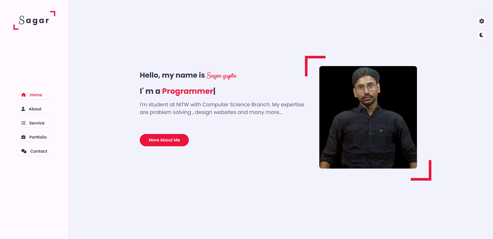
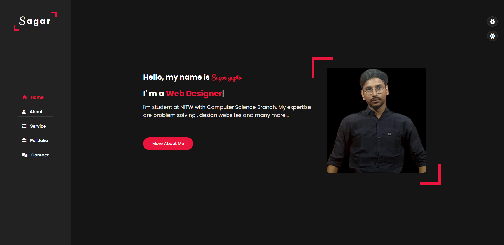
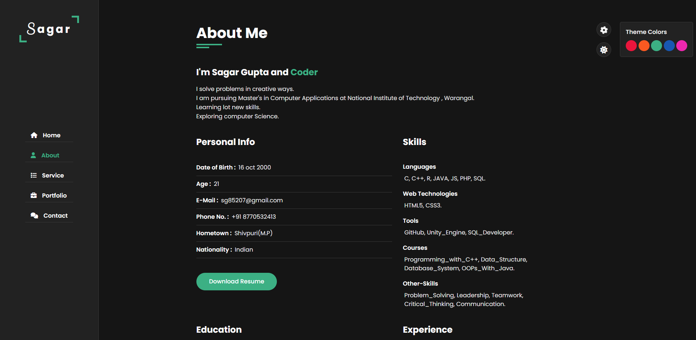
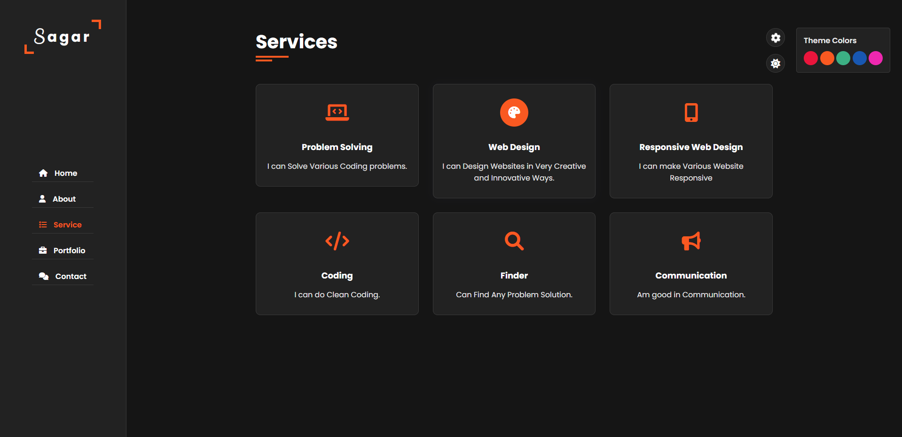

<h1 align="Center">Personal PortFolio</h1>

<h5 align="center"> Project link -> <a href="https://sagargupta16.github.io/PortFolio/">Portfolio</a></h5>

<!-- ABOUT THE PROJECT -->
<h2 id="about-the-project"> :pencil: About The Project</h2>

 
  Those who are not familiar with portfolio website , it is Website which contains is your virtual resume which contains all your details like about,your skill, education ,projects etc.

<!-- OVERVIEW -->
<h2 id="overview"> :cloud: Overview</h2>

 
  In this Project i have designed user interface , navigation bar to travel different places easily ,different information in there withing location which is easy to navigate , it perfectoly showcase's my projects and contact details as well.

<!-- Languages and Tools -->
<h2 id="language-and-description"> 💻 Language and Tools Used</h2>

<ul>
  <li><b>HTML</b> - Implemented Site Structure Using HTML.</li>
  <li><b>CSS</b> - To control presentation, formatting, and layout used CSS.</li>
  <li><b>JavaScript</b> - To control the behavior of different elements used JS.</li>
  <li><b>VS Code</b> - Editor to maintain project and Work on it.</li>
</ul>

<!-- PROJECT FILES DESCRIPTION -->
<h2 id="project-files-description"> :floppy_disk: Project Files Description</h2>

<ul>
  <li><b>index.html</b> - This File Contains All the Structure of my project which is main html file. Which bind up all files.</li>
  <li><b>css/style.css</b> - This File Contain main CSS part of Project all the designing part resides here.</li>
  <li><b>css/style-switcher.css</b> - This File Contains all skins changing part and its Styling and placing.</li>
  <li><b>css/skins/color-1,2,3,4,5</b> - These Files Defines all different colors in different file each skin.</li>
  <li><b>js/script.js</b> - This File Contains all Functionality Working Part of Website from dark mode to navigation bar functionality.</li>
  <li><b>js/style-switcher.js</b> - This File Contains Functionality that i used to switch themes which works on click on skin bar.</li>
</ul>

 
 <h2 id="Project-Images"> Project-Images</h2>

