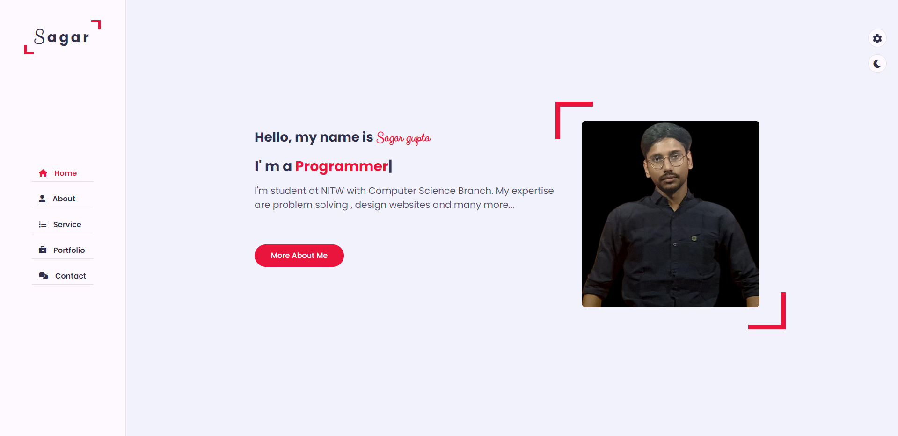
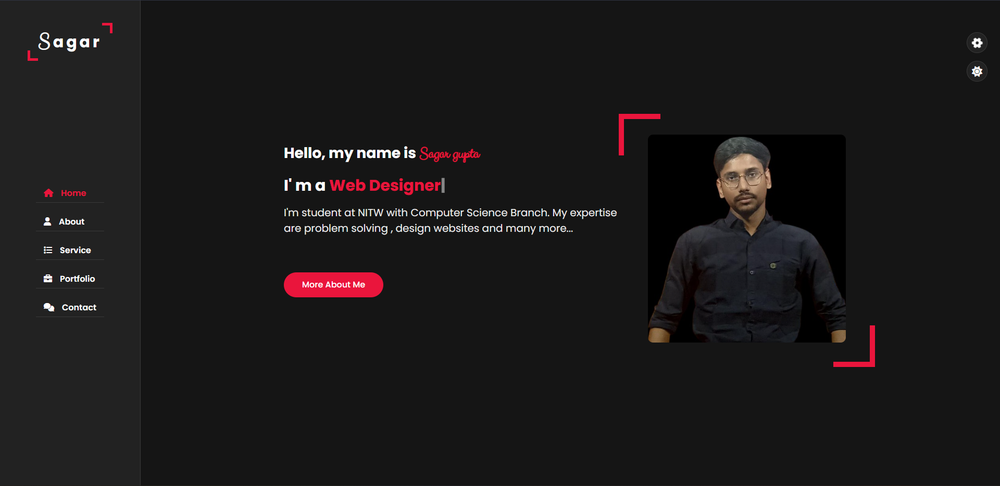
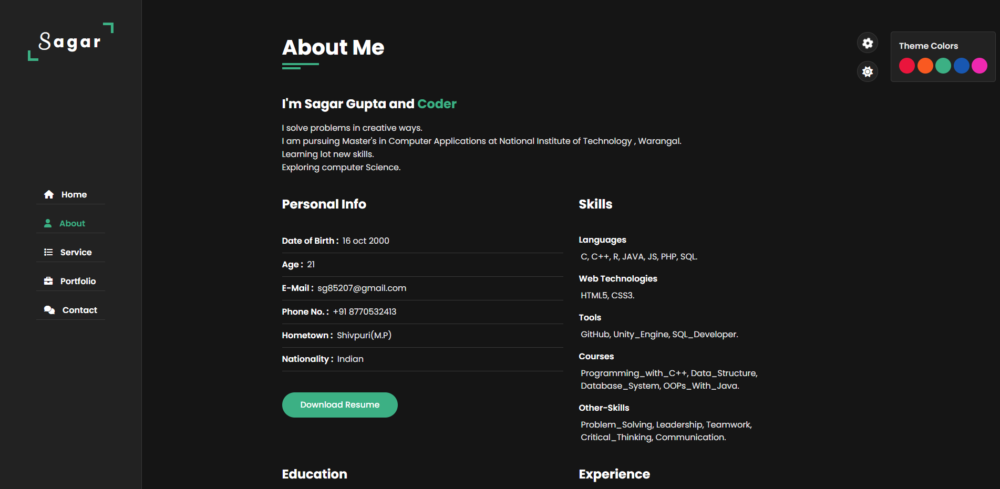
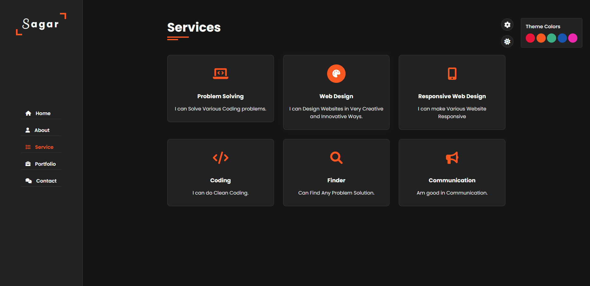

# Personal Portfolio

A responsive portfolio website with multiple color themes, dark/light mode, and smooth navigation -- built with vanilla HTML, CSS, and JavaScript.


## Live Demo

[sagargupta16.github.io/PortFolio](https://sagargupta16.github.io/PortFolio/)

## Overview

A professional portfolio website showcasing skills, projects, and experience. Features a customizable theme system with 5 color skins, dark/light mode toggle, and smooth section-based navigation with typing animations powered by Typed.js.

## Features

- **5 Color Themes** -- Blue, Green, Purple, Orange, and Red skin options
- **Dark/Light Mode** -- Toggle with persistent localStorage preference
- **Typing Animation** -- Animated role titles using Typed.js
- **Smooth Navigation** -- Section-based navigation with active link highlighting
- **Responsive Design** -- Sidebar nav on desktop, collapsible menu on mobile
- **Portfolio Showcase** -- Project cards with descriptions and links
- **Contact Section** -- Direct contact information and social links

## Sections

| Section | Description |
|---------|-------------|
| Home | Introduction with typing animation |
| About | Bio, background, and summary |
| Services | Skills and offerings |
| Portfolio | Project showcase with screenshots |
| Contact | Contact details and social links |

## Tech Stack

| Technology | Usage |
|-----------|-------|
| HTML5 | Page structure and content |
| CSS3 | Styling, themes, responsive layout |
| JavaScript | Navigation, theme switching, animations |
| Typed.js | Typing animation effect |
| Font Awesome 6.4.0 | Icons |

## Project Structure

```
PortFolio/
├── index.html                  # Main portfolio page
├── css/
│   ├── style.css               # Core stylesheet
│   ├── style-switcher.css      # Theme switcher panel styling
│   └── skins/
│       ├── color-1.css         # Blue theme
│       ├── color-2.css         # Green theme
│       ├── color-3.css         # Purple theme
│       ├── color-4.css         # Orange theme
│       └── color-5.css         # Red theme
├── js/
│   ├── script.js               # Core functionality and animations
│   └── style-switcher.js       # Theme switching logic
├── images/                     # Profile photo and project screenshots
└── LICENSE
```

## Getting Started

### Run Locally

```bash
git clone https://github.com/Sagargupta16/PortFolio.git
cd PortFolio

# Open directly in browser
open index.html

# Or use a local server
python -m http.server 8000
# Visit http://localhost:8000
```

### Customization

1. **Content** -- Edit `index.html` to update personal information, projects, and links
2. **Colors** -- Modify files in `css/skins/` to customize theme colors
3. **Images** -- Replace files in `images/` with your own photos and screenshots

## Screenshots






## License

MIT
